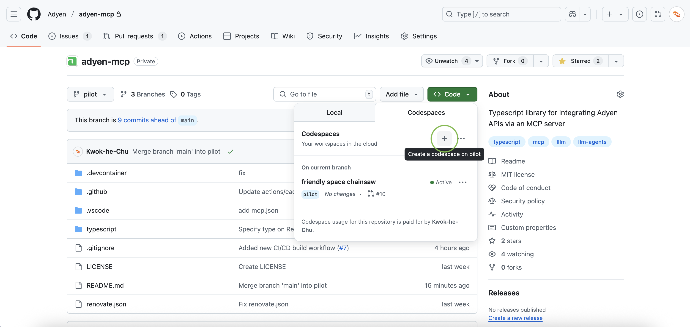
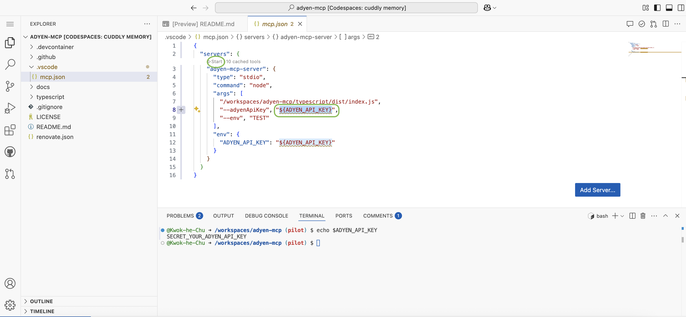
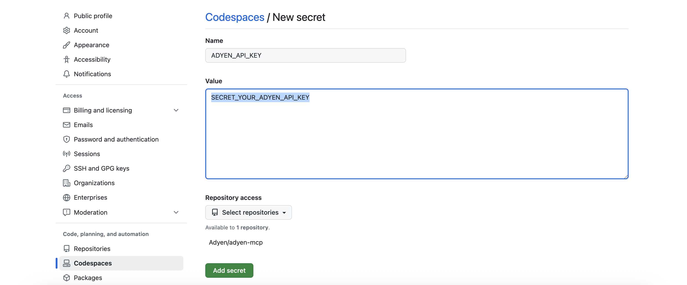
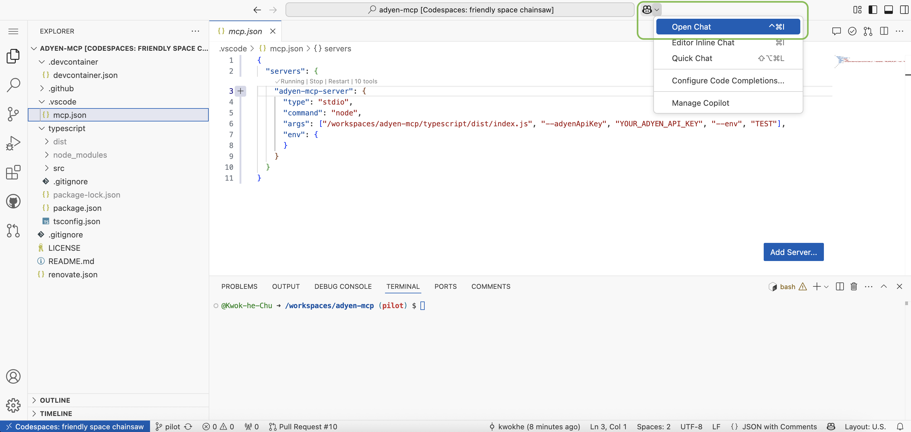
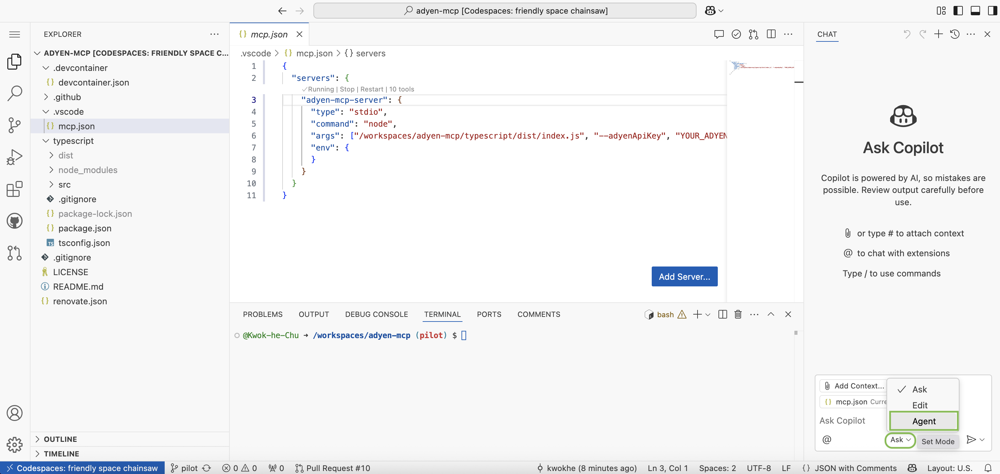

## Adyen MCP Server

The Adyen Model Context Protocol server allows you to integrate with Adyen APIs through LLMs function calling utilizing various Clients. It currently supports the following tools:

1. CheckoutAPI - Sessions
   - Create a /sessions payment request
   - Get the result of a payment session
   - Get the available payment methods
2. CheckoutAPI - Payment Links
   - Gets the status of a payment link
   - Create a payment link
   - Updates a payment link (force expiry of the link)
4. Modifications API - Cancel / Refund 
   - Cancels an authorized payment
   - Refunds a captured payment
5. Management API
   - Gets a list of merchant accounts for your company account


### Usage
To run to the MCP server via `npx` you can execute:

```
npx -y @adyen/mcp --tools=all --adyenApiKey=YOUR_ADYEN_API_KEY --env=TEST
```

Optionally, if the environment is LIVE then you must also provide your Merchant URL, for example:

```
npx -y @adyen/mcp --adyenApiKey=YOUR_ADYEN_API_KEY --env=LIVE --prefixurl=YOUR_PREFIX_URL
```

**Note:** To run certain functionality (tools) in the mcp-server, you need a webservice user with the following roles: 
* Management API - Accounts Read
* Management API - Payment methods Read
* Checkout Webservice Role
* Merchant PAL Webservice Role

Adyen recommends creating a new webservice user and generating a new API key for the purpose of this application.
Only use the new user’s API key for the MCP application and limit the roles to match the tools you'll be using. 


### How to run this on Github Codespaces
1. **Create a new codespace on Github.**


2. **Navigate to `.vscode/mcp.json`, replace `{ADYEN_API_KEY}` with your [Adyen API Key](https://docs.adyen.com/development-resources/api-credentials/#generate-api-key) and click start.**



* **Alternatively**, you may also add your `ADYEN_API_KEY` (TEST) to [Codespaces](https://github.com/settings/codespaces/secrets/new. This securely injects the key into your Codespace environment:




3. **Open Github Copilot's chat and set it to `Agent` mode.**
_Note: You may need to enable [Github Copilot](https://github.com/copilot) on your Github account._






4. **Enter some example prompts.**
```
Create a payment link of 42 euros with my merchant account
```

```
List my merchant accounts
```


### License
MIT license. For more information, see the LICENSE file.


### Contributing
We strongly encourage you to contribute to our repository. Find out more in our contribution guidelines


### Support
If you have a feature request, or spotted a bug or a technical problem, create a GitHub issue. For other questions, contact: devrel@adyen.com
